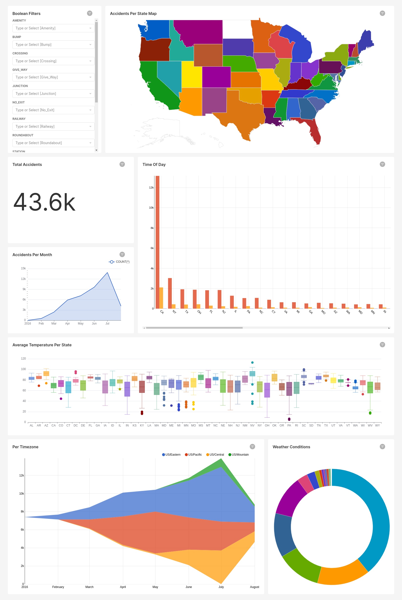

# US-Accidents-Analysis

## Motive

This project was made to practice some of my most recent acquired skills like Pyspark, Pyspark Structured Streaming, Kafka, and Kimball Data Warehousing. Along the way, I also picked up on some SQL and Pyspark tricks and optimizations, and Apache Superset. 

Since I couldn't find any streaming source APIs that I was interested in (most of those are in finanace, stocks, crypto, etc..), I decided to fetch a dataset and stream data from it. The dataset of choice was Kaggle's [US-Accidents](https://www.kaggle.com/datasets/sobhanmoosavi/us-accidents). The exploration of the dataset, some of the reasons why I chose certain tools can be found in [this repo](https://github.com/MohamedAbdeen21/US-accidents-analysis-notebooks). The dimensional model design will be included here. 

This project was inspired by [Zach Wilson](https://www.linkedin.com/in/eczachly) and [HashtagCashtag](https://github.com/shafiab/HashtagCashtag).

## Project Architecture 

## The Process

1. Preparing the stream with Pyspark `prepare_stream.py`:
	1. Read the dataset, which is in `csv` format.
	2. Fill the nulls, assign appropriate columns' data types, and assign time to when to stream the event based on the `Start_Time` and `End_Time` columns.
	3. Write to a single parquet file.

2. Streaming to Kafka with Pyspark Structured Streaming `start_stream.py`:
	1. Read the parquet file
	2. Save the dataset as a `TempView`
	3. keep querying the table for rows between the last time we queried the data (initially zero) and `now()`.
	4. Stream the query result to Kafka.
	5. Repeat untill `now()` equals the the streaming duration (Can be modified in `config.py`, but will obviously require rerunning the first part).

3. Read data from Kafka, process, then write to PostgreSQL Warehouse `kafka_to_DW.py`:
	1. Read the Kafka Stream.
	2. Split the data's columns to fit the dimension tables and the fact table.
	3. Upsert the dimension tables.
	4. Join the new fact rows with the dimension tables to get the foreign keys.
	5. Update the fact table.

4. Visualizing with Apache Superset:
	1. Create a virtual dataset in Superset.
	2. Start creating graphs with custom SQL queries.

5. Create a bash script to run the simulation/project `start.sh`:
	1. Start Zookeeper Server
	2. Start Kafka Server
	3. Start PostgreSQL server
	4. Start Superset
	5. Start the Data Warehouse ETL Pyspark streaming job
	6. Start the stream

## The Dimensional Model

I admit that the ETL unnecessarily recomputes some dimensions like `environmentdimension` and `timeofdaydimension`, because they can be computed in SQL beforehand to contain all possiblevalues. But, I thought that this would be better decision, because it documents the model inside the ETL pipeline itself.

The date dimension was fully created using PostgreSQL built-in functions beforehand.

## The Dashboard

